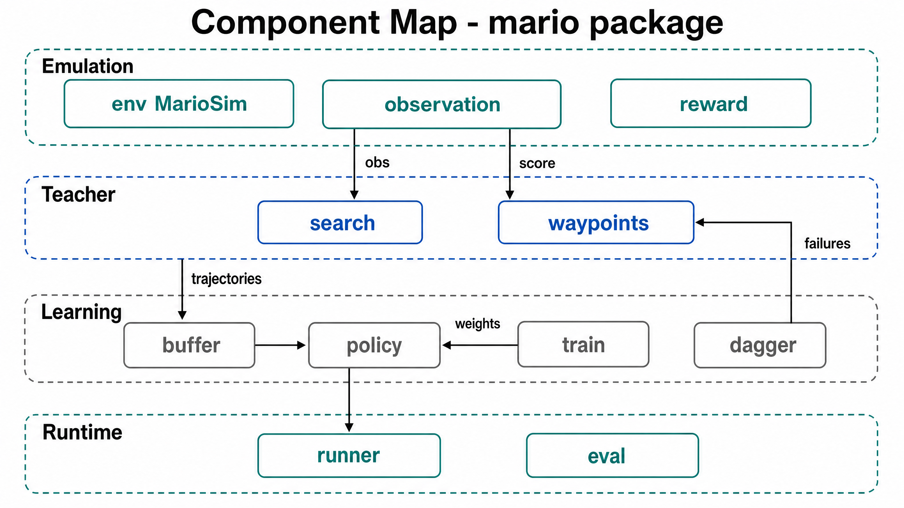
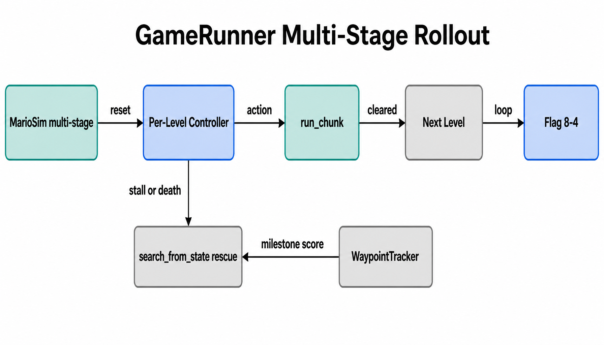

# Mario AI — Architecture Walkthrough

High-level architecture diagrams for the **Mario AI** project: a local, from-scratch
Super Mario Bros. (NES) agent on an M2 Pro. Core idea — the NES is a perfect
deterministic simulator, so **search** it for good action sequences, **distill** those
into a tiny net, **correct** the net on its own failures (DAgger), then optionally
**guide** search with a value net. See `DESIGN.md` for the full rationale.

Diagrams rendered with **OpenAI `gpt-image-2`** (2560×1440, high quality).

## 1. System Context

The system as one box: the operator runs CLI scripts; `Mario AI` drives the **NES Emulator**
(via `nes-py`) with step/snapshot calls, trains tiny nets on **PyTorch MPS**, and writes
trajectories to `data/` and results to `runs/`.

## 2. Component Map

The `mario/` package in four layers: **Emulation** (`env`/`MarioSim`, `observation`, `reward`),
the **Teacher** (`search`, `waypoints`), **Learning** (`buffer`, `policy`, `train`, `dagger`),
and **Runtime** (`runner`, `eval`). Observation + reward feed the search teacher; search emits
trajectories to the buffer; training produces policy weights; DAgger feeds failures back to search.

## 3. Expert-Iteration Loop

The heart of the project. **Beam Search Teacher** produces best action chunks → **Trajectory
Buffer** → soft behavior-cloning trains the **Student Policy** → rollout failures go to **DAgger
Correction**, which re-labels states with the teacher. The **NES Simulator** is the shared forward
model that both the teacher and DAgger query.

## 4. GameRunner Multi-Stage Rollout

How `GameRunner` plays a full multi-stage run. `MarioSim` resets, a **per-level Controller** picks
actions executed by `run_chunk`; on stall or death it falls back to `search_from_state` rescue
(guided by `WaypointTracker` milestone scoring), advancing level-to-level toward the **8-4 flag**.

---
*Regenerate any single diagram by editing its entry in the spec and re-running
`scripts/generate_diagrams.py` with a one-entry spec.*
