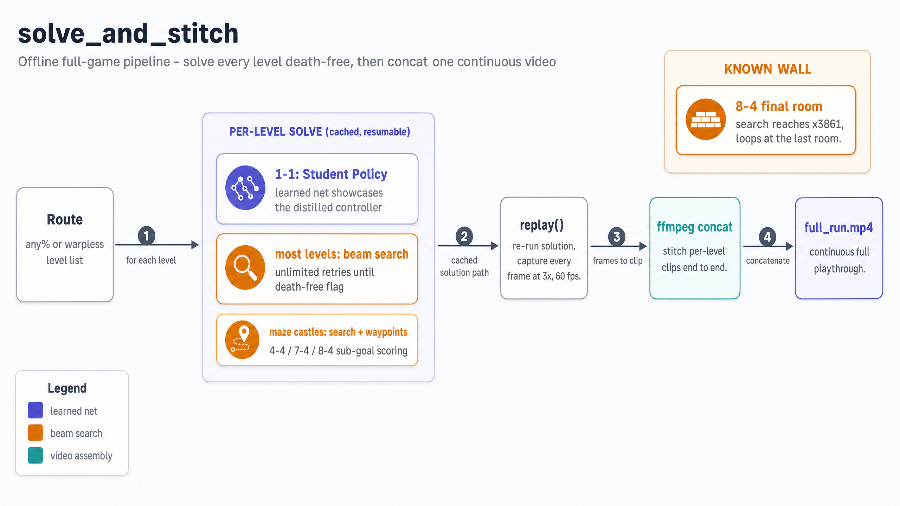

# Mario AI — Architecture Walkthrough

High-level architecture diagrams for the **Mario AI** project: a local, from-scratch
Super Mario Bros. (NES) agent on an Apple M2 Pro. Core idea — the NES is a perfect
deterministic simulator, so **search** it for good action sequences, **distill** those
into a tiny net, **correct** the net on its own failures (DAgger), then assemble a
full-game playthrough. See `DESIGN.md` for the full rationale.

Diagrams rendered with **OpenAI `gpt-image-2`** (2560×1440, high quality).

## 1. System Context

The system as one box: the operator runs CLI entrypoints (`v0_search_1_1.py`,
`train.py` / `run_dagger.py`, `solve_and_stitch.py`); `Mario AI` drives the **NES Emulator**
(`gym-super-mario-bros` + `nes-py`) with step/snapshot/restore, trains tiny nets on
**PyTorch MPS**, and writes trajectories to `data/`, results to `runs/`, and a stitched
`full_run.mp4` via **ffmpeg**.

## 2. Component Map

The `mario/` package in four layers: **Emulation & Perception** (`env`/`MarioSim`, `ram`,
`observation` — a 5-channel, 1048-dim ego grid, `reward`), the **Search Teacher** (`search`
beam width 32 / depth 400, `waypoints`), **Learning** (`label`, `buffer`, `policy` MLP +
value head, `train`), and **Runtime & Verification** (`runner`, `eval`, `render`,
`artifacts`). Observation + reward feed the scorer; search emits trajectories to the buffer;
training produces policy weights consumed by the runtime.

## 3. Expert-Iteration Loop

The heart of the project. **Beam Search Teacher** → **Trajectory Buffer** (hard label + soft
entropy targets, K=4 stack) → soft behavior-cloning trains the **Student Policy** (~1.85M
params) → rollout failures go to **DAgger Correction**, which re-labels states with the
teacher. The shared **MarioSim** forward model (~1380 fps) answers queries from both the
teacher and DAgger. Verified: 1-1 cleared 30/30; World 1 + 2-1 (5 levels) via net + search.

## 4. solve_and_stitch Pipeline

The offline full-game engine. For each level on the route (any% / warpless), solve it
death-free — the **learned net** showcases 1-1, **beam search** (unlimited retries) clears
most levels, and **search + waypoints** handles maze castles. `replay()` re-runs each cached
solution capturing every frame, and **ffmpeg** concatenates the per-level clips into one
continuous `full_run.mp4`. Known wall: 8-4's final room (search reaches x3861, then loops).

---
*Regenerate any single diagram by editing its entry in the spec and re-running
`scripts/generate_diagrams.py` with a one-entry spec.*
