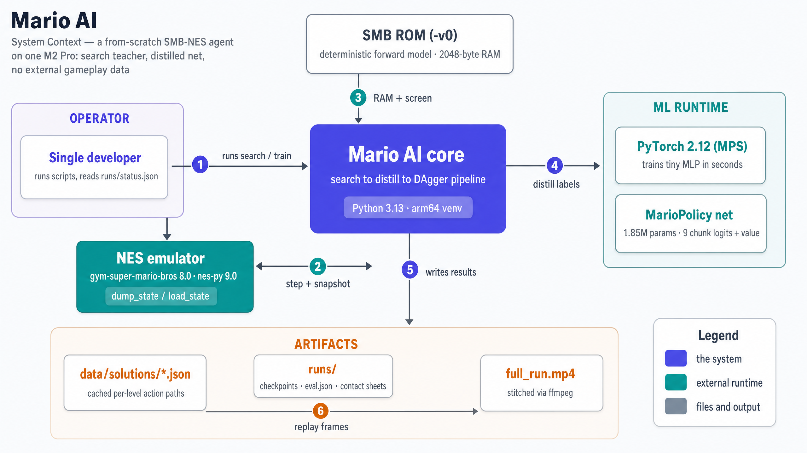
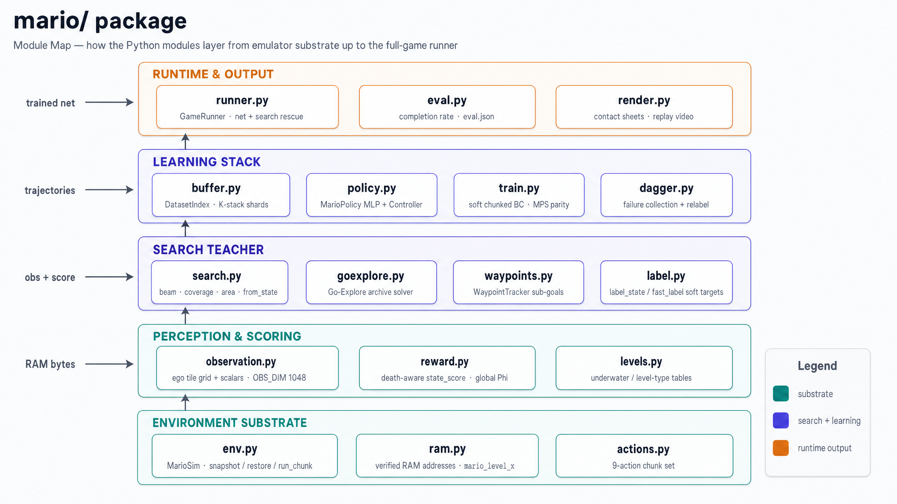
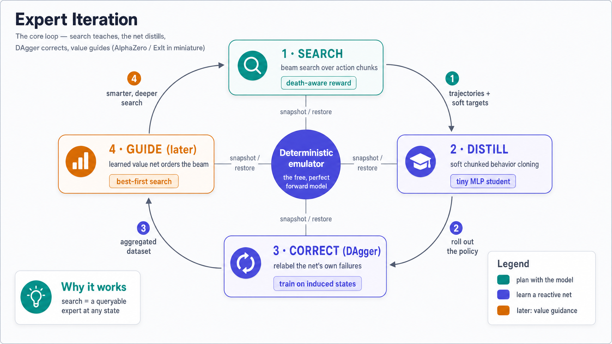
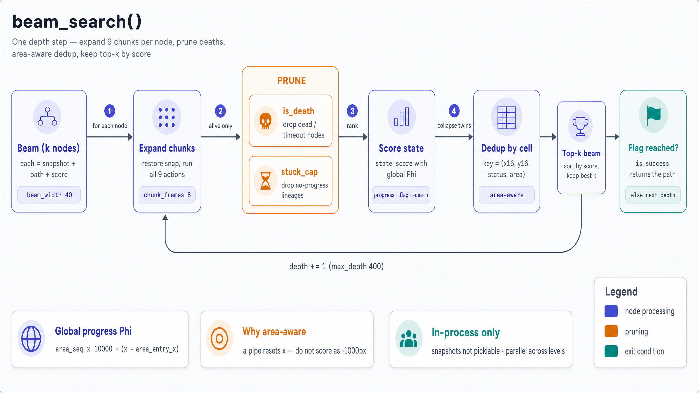
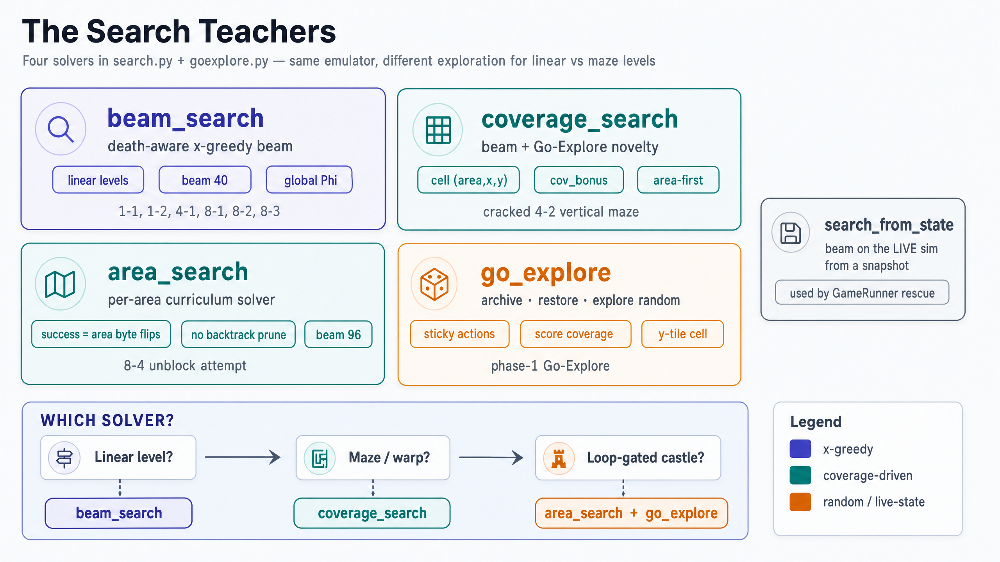
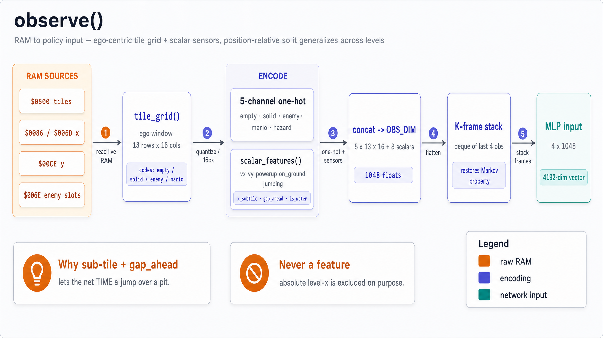
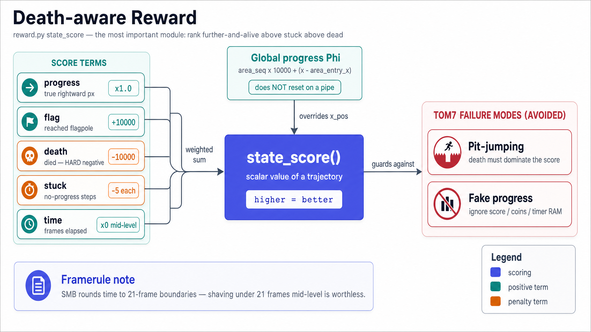
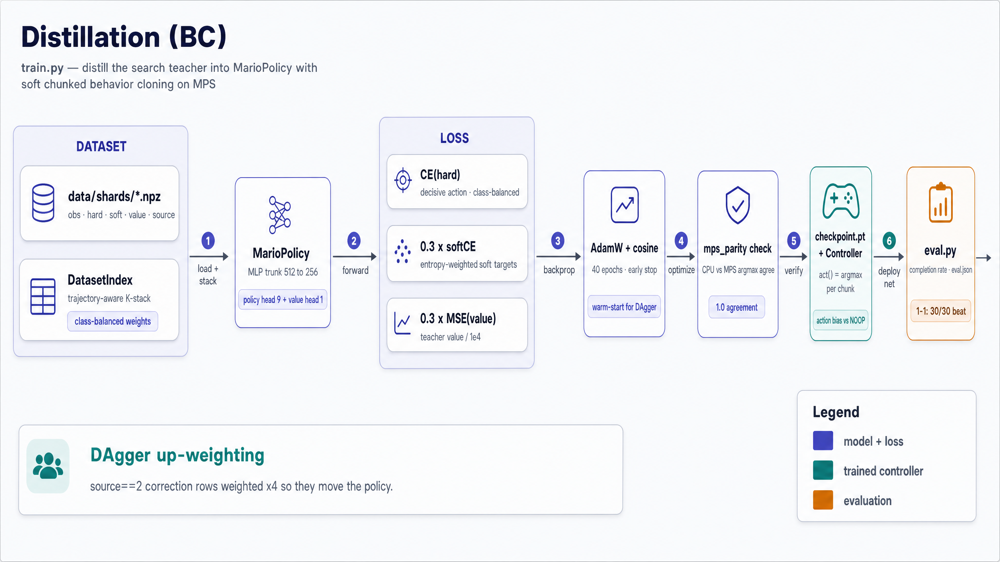
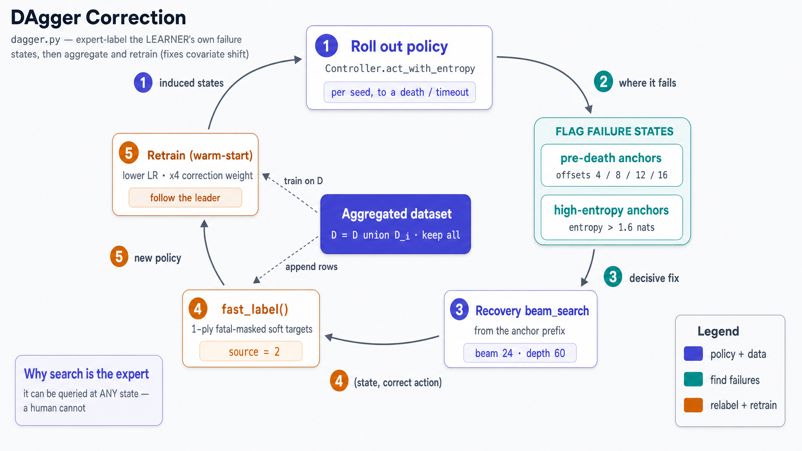
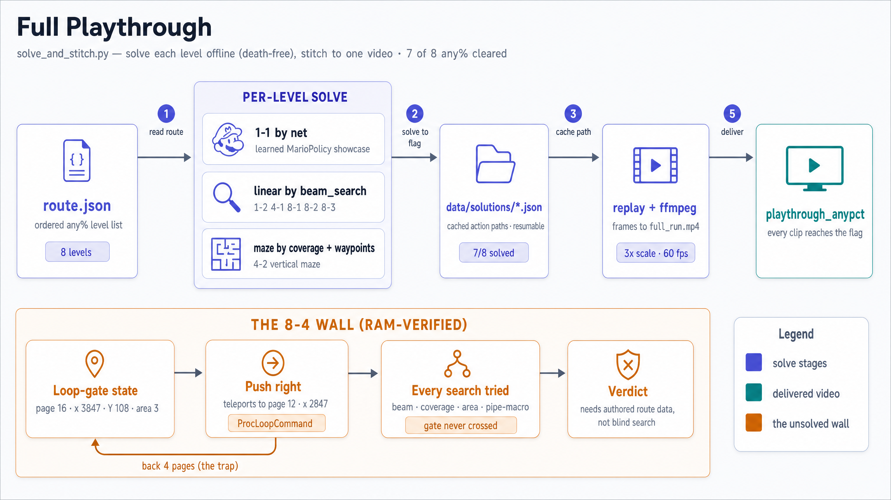

# Mario AI — Architecture Diagrams

A visual walkthrough of the from-scratch Super Mario Bros (NES) agent: **search teacher → distill → DAgger → value-guided search**, all on one M2 Pro with no external gameplay data. Read top to bottom — context first, then the modules, the core loop, and each subsystem in detail.

Rendered with **OpenAI `gpt-image-2`** (2560×1440, high quality). Source prompts grounded in the actual code (`mario/`), `DESIGN.md`, and `CLAUDE.md`.

---

### 1. System Context

The whole project at a glance: the developer drives search/training; the deterministic NES emulator (`gym-super-mario-bros` / `nes-py`) is the forward model; PyTorch-MPS trains the tiny net; artifacts land in `data/solutions/`, `runs/`, and the stitched `full_run.mp4`.

### 2. Module Map

How `mario/` layers up — from the emulator substrate (`env.py`, `ram.py`, `actions.py`) through perception/scoring and the search teacher, to the learning stack and the full-game runtime.

### 3. Expert Iteration Loop

The core idea: **search** teaches, the net **distills**, **DAgger** corrects the net's own failures, and (later) a learned value net **guides** the search — AlphaZero/ExIt in miniature, powered by free emulator snapshots.

### 4. Beam Search Internals

One depth step of `beam_search()`: expand all 9 action-chunks per node, prune deaths and stuck lineages, score with the global progress coordinate Φ, area-aware dedup, keep top-k.

### 5. The Search Teachers

Four solvers for different level shapes: `beam_search` (linear), `coverage_search` (mazes/warps), `area_search` (loop-gated castles), `go_explore` (random archive), plus `search_from_state` for live rescue.

### 6. Observation Vector

`observe()` turns RAM into the policy input: an ego-centric tile grid + scalar sensors → 5-channel one-hot → `OBS_DIM` 1048 → K-frame stack → a 4192-dim MLP input. Absolute level-x is never a feature.

### 7. Death-aware Reward

`reward.py state_score` — the most important module. Weighted terms (progress, flag, death, stuck, time) plus the global Φ coordinate, designed to avoid Tom7's two canonical failures: pit-jumping and fake-progress counters.

### 8. Distillation Pipeline

`train.py` distills the teacher into `MarioPolicy`: sharded dataset → K-stack → MLP → soft chunked BC loss (CE + soft + value) → MPS-parity check → `Controller` → eval (1-1: 30/30).

### 9. DAgger Correction Loop

`dagger.py` fixes covariate shift: roll out the policy, flag its failure states (pre-death + high-entropy anchors), run a recovery beam search, `fast_label` the fix, aggregate, retrain.

### 10. Full Playthrough & the 8-4 Wall

`solve_and_stitch.py` solves each level offline (death-free) and concatenates them — **7 of 8 any% levels cleared**. The lone holdout, 8-4, is a RAM-verified `ProcLoopCommand` loop-gate that no forward search variant crosses.
