# Mario AI — Architecture Diagrams

Two sets. Read the **current** set first; it matches the July 28, 2026 research
contract. The June 2026 set is a historical V0–V4 walkthrough and is stale on
several facts (8-4 is solved; learning is search guidance, not a replacement
controller; SMA4 option work exists).

Rendered with **OpenAI `gpt-image-2`** (2560×1440, high quality).

---

## Current architecture (July 2026)

### 1. System context
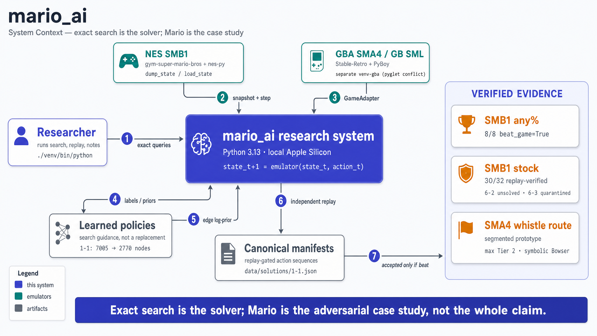
Exact search is the solver; Mario is the adversarial case study, not the whole claim.

### 2. Module map
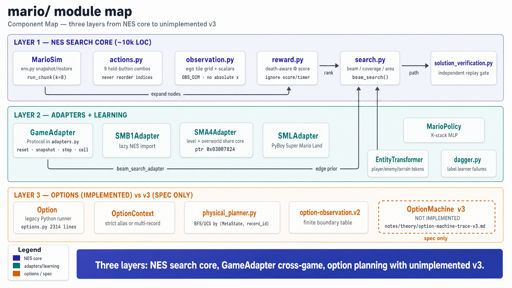
Three layers: NES search core, GameAdapter cross-game, option planning with unimplemented v3.

### 3. Search → replay lifecycle
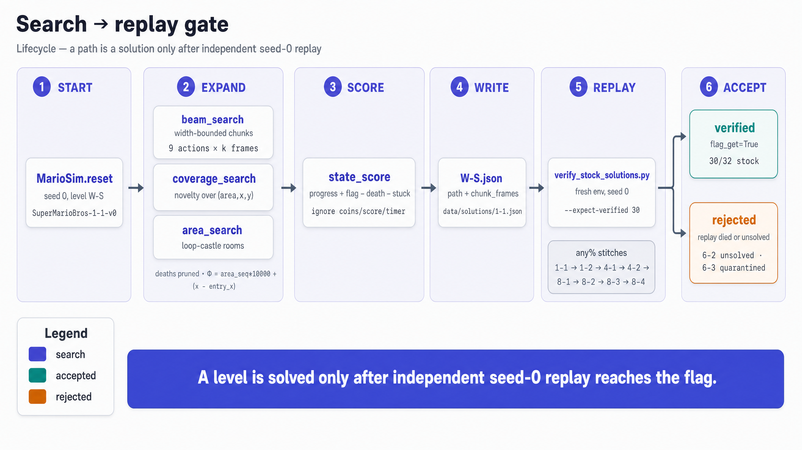
A level is solved only after independent seed-0 replay reaches the flag.

### 4. Five scientific objects
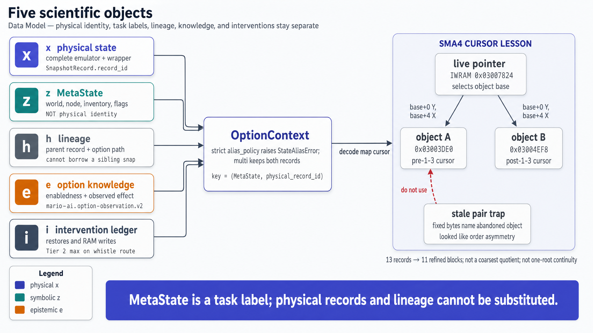
MetaState is a task label; physical records and lineage cannot be substituted.

### 5. Two-branch research program
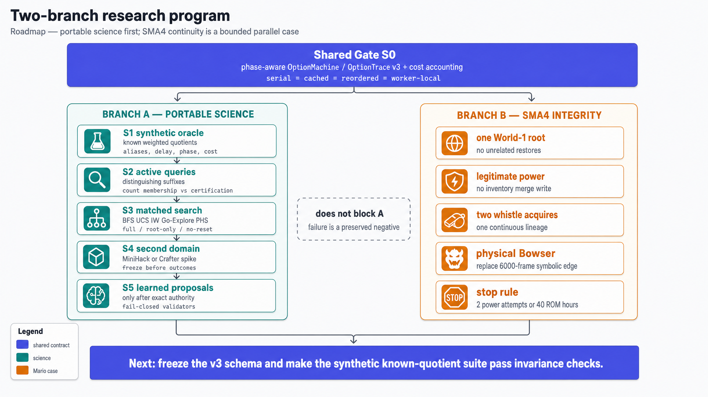
Next: freeze the v3 schema and make the synthetic known-quotient suite pass invariance checks.

---

## Historical V0–V4 walkthrough (June 2026)

These diagrams document the original NES search → distill → DAgger story. Treat
captions as period evidence. In particular, diagram 10 still says 8-4 is a
holdout; that was later solved and any% is 8/8.

### H1. System Context
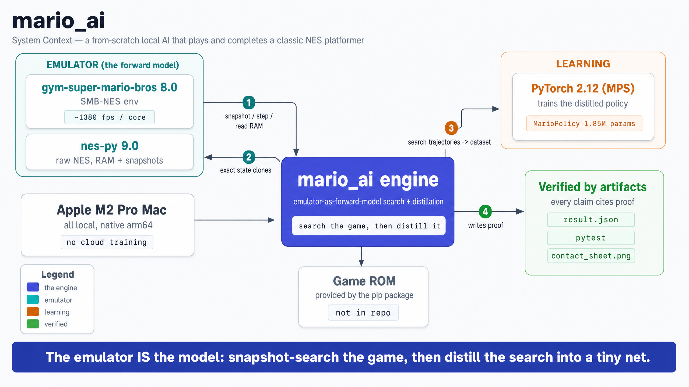
The developer drives search/training; the NES emulator is the forward model.

### H2. Module Map
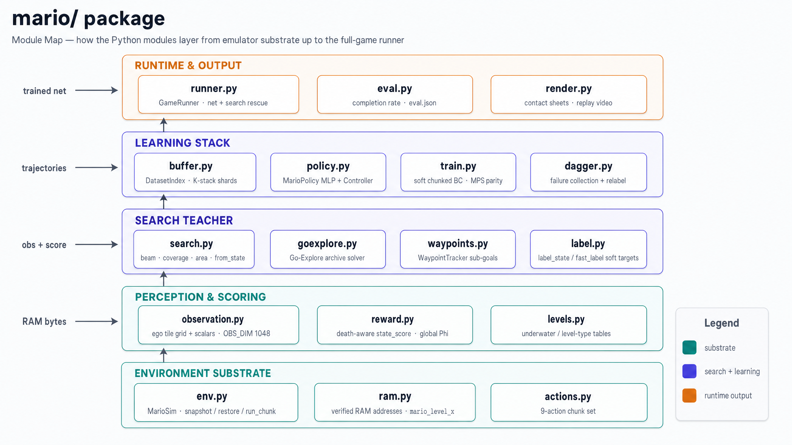
How `mario/` layered up before adapters and option planning.

### H3. Expert Iteration Loop
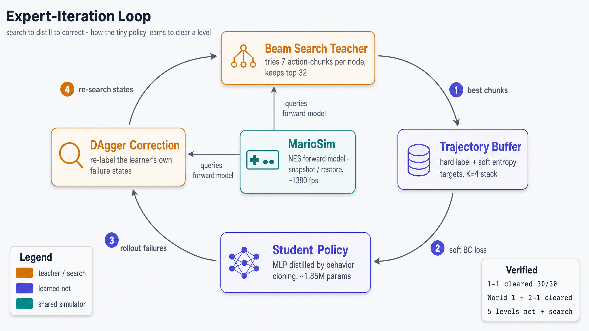
Search teaches, the net distills, DAgger corrects learner failures.

### H4. Beam Search Internals
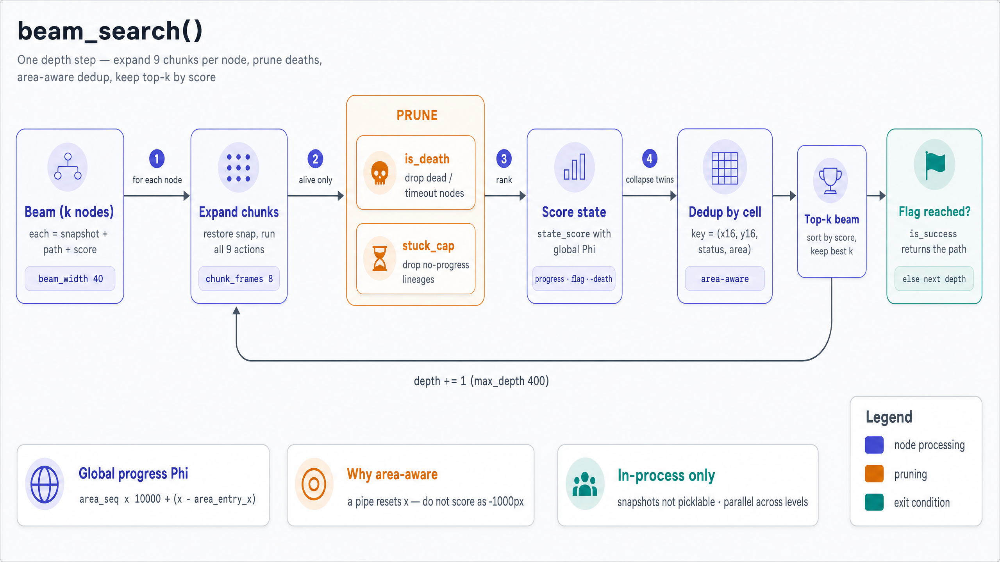
One depth step of `beam_search()`: expand chunks, prune deaths, score Φ, keep top-k.

### H5. The Search Teachers
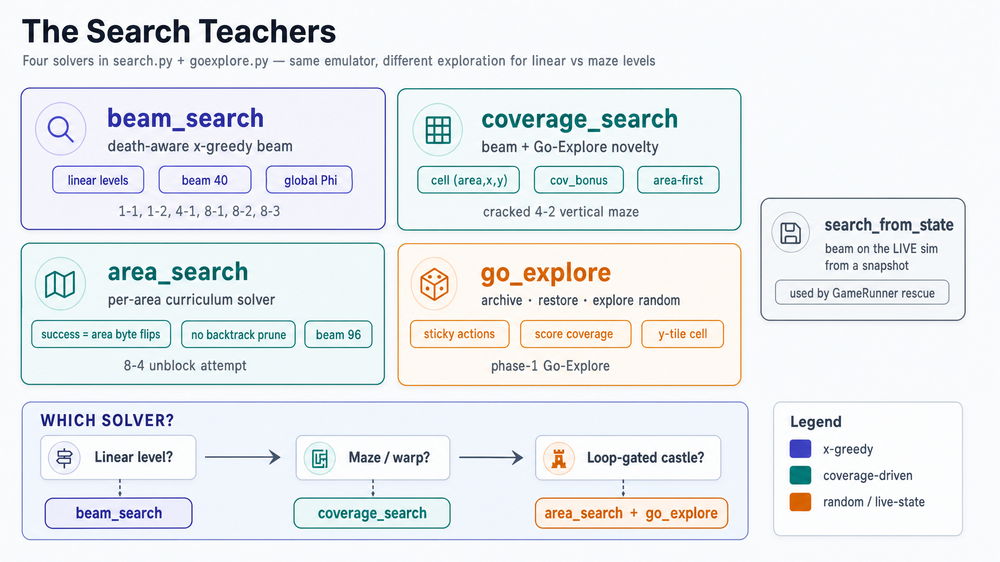
`beam_search`, `coverage_search`, `area_search`, `go_explore`, plus live rescue.

### H6. Observation Vector
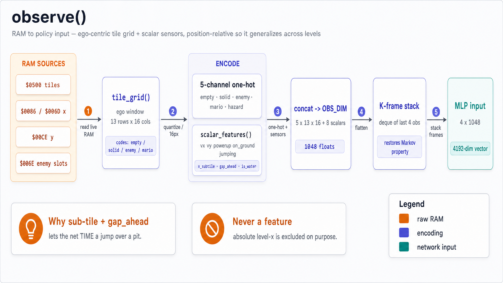
Ego-centric tile grid + scalars; absolute level-x is never a feature.

### H7. Death-aware Reward
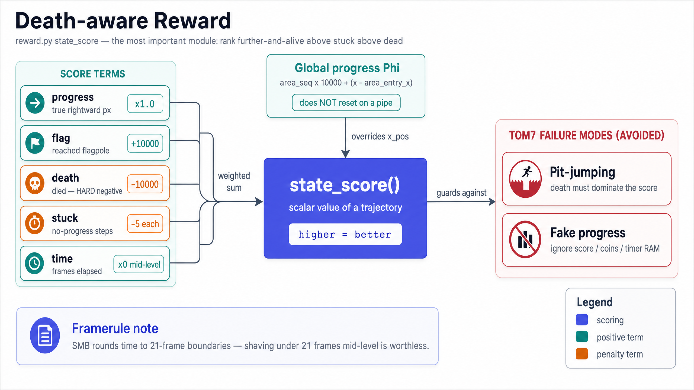
`state_score` avoids Tom7's pit-jump and fake-progress-counter failures.

### H8. Distillation Pipeline
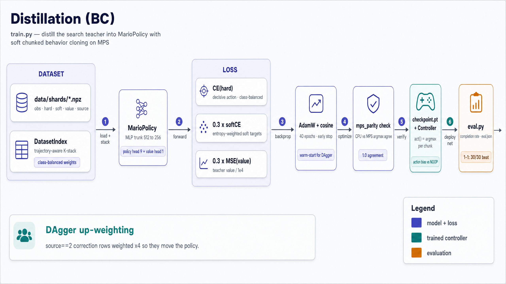
Search trajectories become a compact `MarioPolicy`.

### H9. DAgger Correction Loop
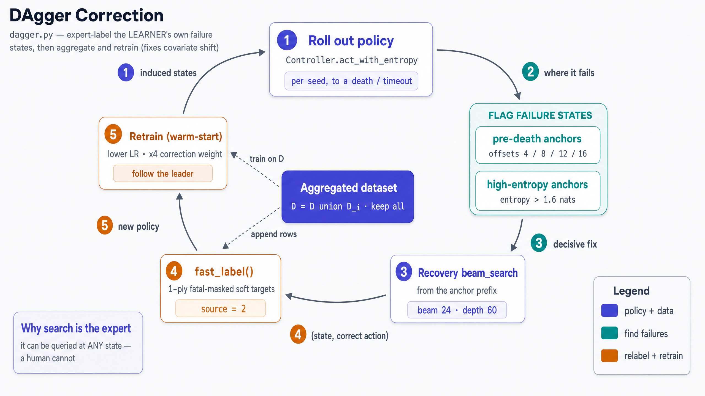
Label the learner's own pre-death and high-entropy states.

### H10. Full Playthrough & the 8-4 Wall (outdated)
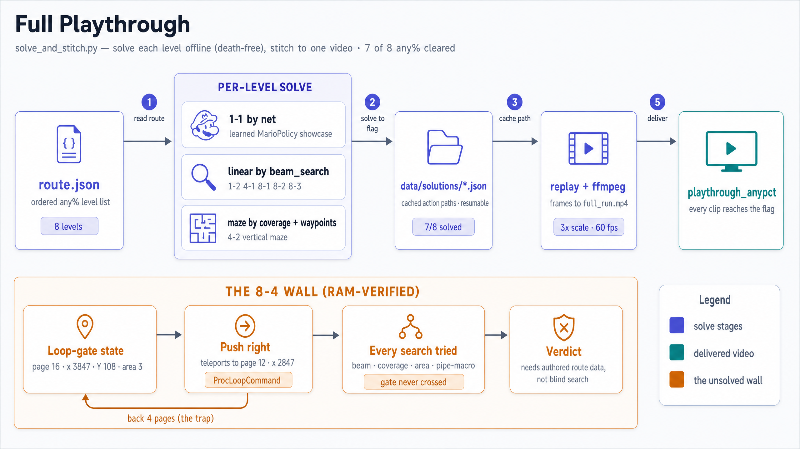
Period caption: 7 of 8 any% levels. **Superseded:** 8-4 is solved; any% is 8/8.
