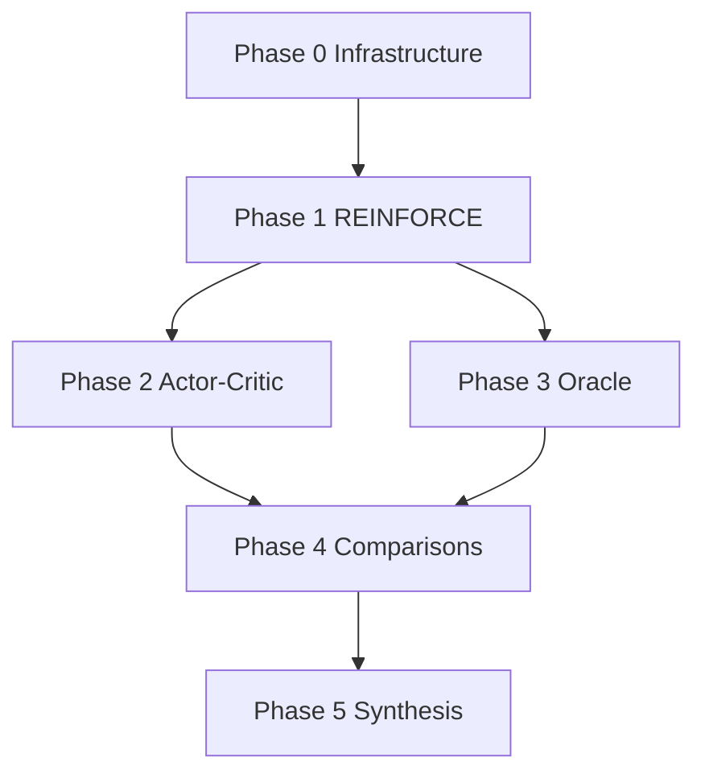

# Implementation phases

Technical phases with **acceptance criteria** (no calendar estimates). Complete in order; later
phases depend on artifacts from earlier ones.

---

## Phase 0 — Infrastructure

**Goal:** Rollout engine + artifact contract + sanity experiment.

### Deliverables

| Item | Path | Status |
|---|---|---|
| Package init | `mario_pg/__init__.py` | planned |
| Rollout + reward wrapper | `mario_pg/rollout.py` | planned |
| Episode logger | `mario_pg/logging.py` | planned |
| Config loader | `mario_pg/config.py` | planned |
| Sanity script | `scripts/00_sanity_rollout.py` | planned |
| Artifact schema | `artifacts/SCHEMA.md` | done |
| `.gitignore` for runs | `artifacts/.gitignore` | planned |

### `mario_pg/rollout.py` interface

```python
@dataclass
class ChunkTransition:
    obs_stack: np.ndarray      # [K * OBS_DIM]
    action: int
    log_prob: float
    reward: float
    value_baseline: float | None
    info: dict
    done: bool

def rollout_episode(net, sim, *, stochastic: bool, gamma: float) -> list[ChunkTransition]:
    """One 1-1 attempt from reset. Rewards from mario.reward.state_score deltas."""
```

### Acceptance criteria

- [ ] `00_sanity_rollout.py` exits 0; writes valid `episodes.csv` per SCHEMA
- [ ] Rewards match manual check: +Δx on progress, −death on pit, +flag on win
- [ ] `pytest learn_papers/sutton_1999/tests/` green (schema + rollout unit tests)

### Tests to add

- `test_reward_delta.py` — chunk reward signs
- `test_log_prob.py` — stochastic policy log_prob matches `Categorical`

---

## Phase 1 — REINFORCE family (Exp 01–04)

**Goal:** Working policy-gradient trainer; variance reduction ablation data.

### Deliverables

| Item | Path |
|---|---|
| REINFORCE trainer | `mario_pg/reinforce.py` |
| Baseline modules | `mario_pg/baseline.py` (constant, learned V) |
| Train script | `scripts/train_reinforce.py` |
| Configs | `configs/exp01_*.yaml` … `exp04_*.yaml` |
| Analysis | `analysis/plot_learning_curves.py`, `analysis/plot_grad_variance.py` |

### `mario_pg/reinforce.py` interface

```python
def reinforce_update(
    net: nn.Module,
    trajectory: list[ChunkTransition],
    *,
    baseline: Baseline | None,
    gamma: float,
    entropy_coef: float,
) -> dict[str, float]:
    """Returns {loss, grad_norm, grad_var, mean_return, entropy}."""
```

### Acceptance criteria

- [ ] Exp 01: `mean_return` trend positive over first 500 episodes (noisy OK) OR `best_x_pos` increases
- [ ] Exp 02: `grad_var` < Exp 01 (same seeds, matched steps)
- [ ] Exp 03: `grad_var` < Exp 02; sample efficiency ≥ Exp 02 at episode 1000
- [ ] Exp 04: advantage arm beats return arm on `grad_var`
- [ ] Learning curve plots regenerate from CSV alone

---

## Phase 2 — Actor–critic + compatibility (Exp 05–06)

**Goal:** Compatible critic; gradient alignment measurement; policy iteration loop.

### Deliverables

| Item | Path |
|---|---|
| Compatible AC | `mario_pg/actor_critic.py` |
| Per-action features φ | `mario_pg/features.py` |
| Gradient alignment | `mario_pg/grad_align.py` |
| Oracle Q helper | `mario_pg/oracle.py` (wraps `label_state`) |
| Scripts | `scripts/train_actor_critic.py`, `scripts/measure_grad_alignment.py` |

### Feature map \(\phi_{sa}\) (v1)

Reuse a **single** `observe()` vector concatenated with action one-hot → dim `OBS_DIM + N_ACTIONS`.
Linear softmax policy + linear advantage critic on centered features (paper §3 Gibbs example).

Future: entity-transformer features from `scripts/exp_entity.py`.

### Acceptance criteria

- [ ] Exp 05: `compatible_linear` mean `cos_grad` > `shared_trunk` by ≥0.1
- [ ] Exp 06: 5 policy-iteration rounds without return collapse; critic val loss decreases each round
- [ ] `measure_grad_alignment.py` runs in <10 min for n_states=200 on 1-1

---

## Phase 3 — Oracle ablations (Exp 07–08)

**Goal:** Upper-bound PG with search-labeled advantages; validate Theorem 1 operationally.

### Deliverables

| Item | Path |
|---|---|
| Oracle labeling batch | `mario_pg/oracle.py::batch_advantages` |
| Oracle AC trainer | `mario_pg/oracle_ac.py` |
| Scripts | `scripts/oracle_gradient_check.py`, configs exp07–08 |

### Acceptance criteria

- [ ] Exp 07: mean `cos_grad` > 0.85 for oracle Q at fixed π
- [ ] Exp 08: reaches 90% completion in fewer episodes than Exp 03 (same eval seeds)
- [ ] Document $ cost: `label_state` calls per episode in `summary.json`

---

## Phase 4 — Comparisons + scale (Exp 09–11)

**Goal:** Position PG relative to repo's BC/DAgger; demonstrate chattering; multi-level.

### Deliverables

| Item | Path |
|---|---|
| Wall-clock benchmark | `scripts/benchmark_pg_vs_imitation.py` |
| Chattering demo | `scripts/value_greedy_chatter.py` |
| Multi-level PG | `scripts/train_multitask_pg.py` |
| Compare dashboard | `analysis/compare_experiments.py` |

### Acceptance criteria

- [ ] Exp 09: table in `FINDINGS.md` with completion @ fixed wall-clock
- [ ] Exp 10: `action_flip_rate` (value-greedy) > `kl_policy_change` (PG) by clear margin
- [ ] Exp 11: multi-task PG shows ≥2 levels with oscillating completion (or per-level specialists win)

---

## Phase 5 — Synthesis

**Goal:** Written findings + optional interactive notebook.

### Deliverables

| Item | Path |
|---|---|
| Findings doc | `FINDINGS.md` (filled) |
| Summary notebook | `analysis/synthesis.ipynb` (optional) |
| Link from main README | one line in root `README.md` |

### Acceptance criteria

- [ ] Every experiment 01–11 has a row in FINDINGS summary table
- [ ] Three scale implications articulated (simulator oracle, chunk credit, multi-task local optima)
- [ ] Repro command block reproduces main figures from committed CSVs in `artifacts/bundled/` (optional snapshot)

---

## Dependency graph



---

## Risk register

| Risk | Mitigation |
|---|---|
| REINFORCE never clears pit at cf=8 | Exp 05b: cf=4; entropy bonus; Exp 08 oracle ceiling |
| `label_state` too slow for online AC | Subsample every 4 chunks; cache labels by prefix hash |
| PG worse than BC always | Expected — document as finding; oracle AC shows ceiling |
| MPS nondeterminism | Train PG on CPU; match `mario/eval.py` convention |
